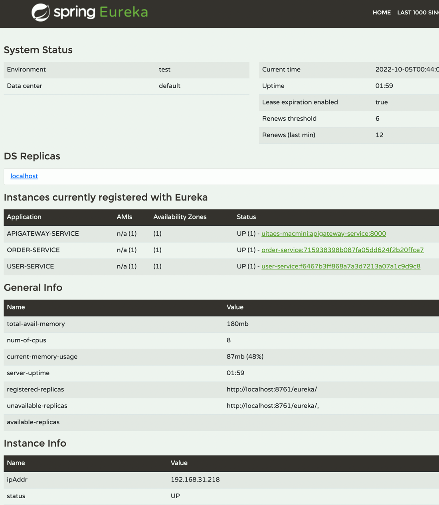
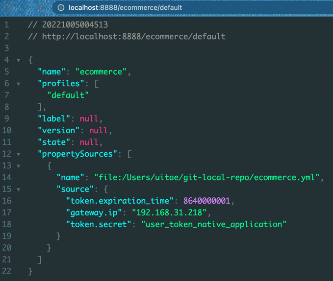

# MSA-config-service
마이크로서비스 config service

discovery server

cloud:
    config:
        server:
            native:
                search-locations: file:///Users/uitae/git-local-repo  
설정파일을 가져온다  
git 에 올라간 내역들을 가져오는것도 가능 

설정 변경 후  
POST http://localhost:8000/actuator/busrefresh 로 설정 리프레시 